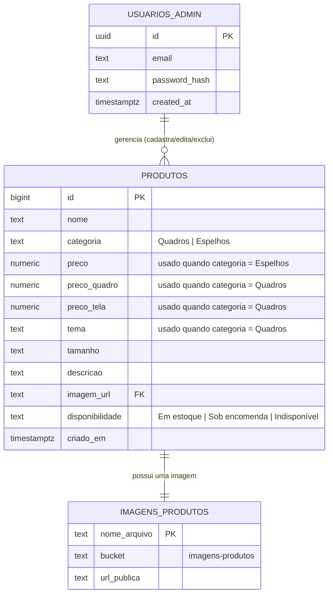

# DER — Diagrama de Entidade-Relacionamento

Estrutura de dados do projeto **Cidade da Arte**, hospedada no Supabase (Postgres).

O banco é simples: uma única tabela de negócio (`produtos`), mais o schema de autenticação nativo do Supabase (`auth.users`) e um bucket de arquivos (`storage`) para as imagens.

## Observações

- **`USUARIOS_ADMIN`** é o schema `auth.users`, gerenciado automaticamente pelo Supabase Auth — não é uma tabela criada manualmente. A relação com `PRODUTOS` é **lógica** (só administradores autenticados podem alterar produtos via RLS), não existe uma coluna de chave estrangeira (`user_id`) na tabela `produtos`.
- **`IMAGENS_PRODUTOS`** representa os arquivos no bucket de Storage `imagens-produtos`. A ligação com `PRODUTOS` é feita pela URL pública salva na coluna `imagem_url`, não por uma FK de banco de dados de fato.
- **`categoria`** define quais colunas de preço/tema são usadas:
  - `Quadros` → usa `preco_quadro`, `preco_tela` e `tema`
  - `Espelhos` → usa apenas `preco`
- Não existe carrinho, pedido ou tabela de clientes — o "checkout" é feito externamente, via WhatsApp (a mensagem é montada no front-end com os dados do produto).
